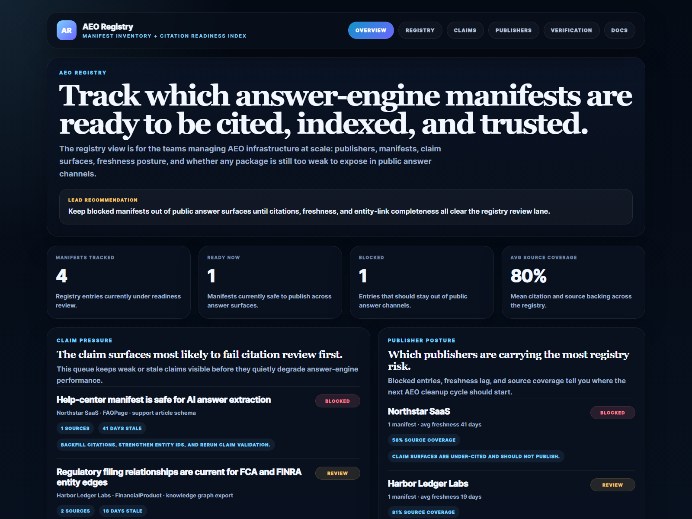
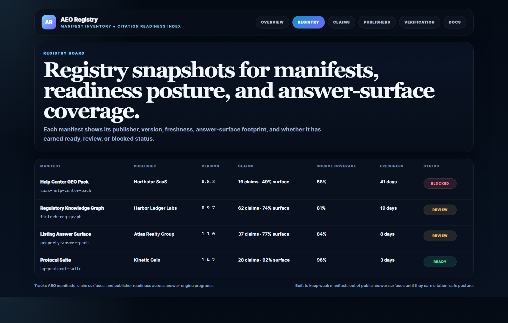
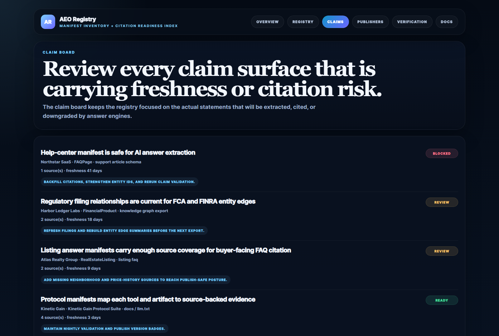
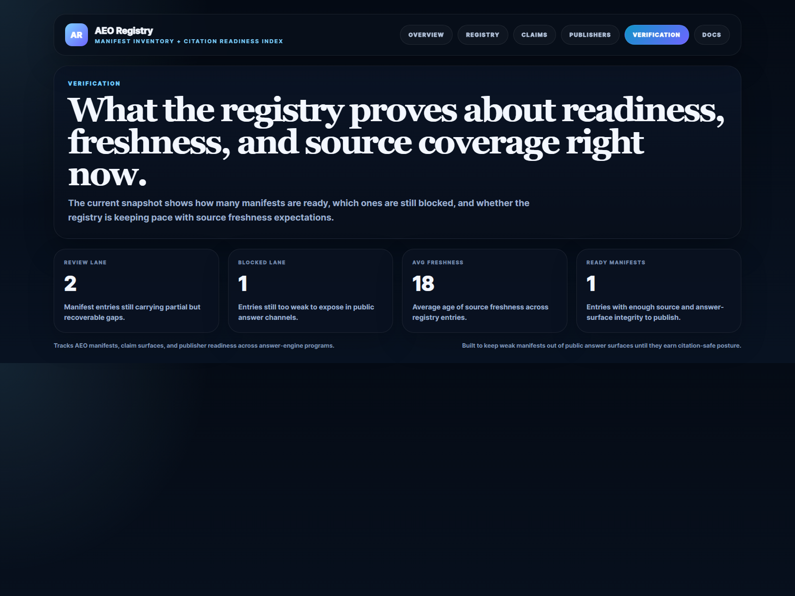

# AEO Registry

TypeScript and Express registry for **tracking AEO manifests, publisher readiness, claim surfaces, and citation-safe discovery posture**.

> **What this repo proves**
>
> AEO work gets much more durable when manifests are not just published, but indexed, reviewed, and held to a clear readiness bar for freshness, source coverage, and answer-surface integrity.

## Why this repo exists

Most AEO programs eventually end up with more manifests than they can reason about cleanly. One team publishes `llm.txt`. Another emits JSON-LD. A vertical site adds FAQ schema. A support team pushes answer-packaging metadata. Without a registry, those assets exist, but nobody has a single view of which ones are fresh, which ones are weakly sourced, and which ones should never have been exposed to answer engines in the first place.

`aeo-registry` turns that sprawl into an operator-friendly inventory. It tracks manifests by publisher, version, freshness, source coverage, and answer-surface footprint, then keeps the claims and portfolios that need review visible before they degrade trust or citation quality.

## Screenshots






## What it includes

- Express app with HTML proof surfaces and JSON APIs
- sample manifest inventory across AEO infrastructure, fintech, SaaS, and real estate
- readiness scoring for freshness, source coverage, and answer-surface completeness
- claim review queue for blocked and review-level surfaces
- publisher portfolio posture for multi-manifest programs
- real browser-rendered README proof assets captured from the running app
- Vitest coverage plus demo and smoke validation scripts

## Local run

```powershell
cd aeo-registry
npm install
npm run dev
```

Open:

- [http://127.0.0.1:5084/](http://127.0.0.1:5084/)
- [http://127.0.0.1:5084/registry](http://127.0.0.1:5084/registry)
- [http://127.0.0.1:5084/claims](http://127.0.0.1:5084/claims)
- [http://127.0.0.1:5084/publishers](http://127.0.0.1:5084/publishers)
- [http://127.0.0.1:5084/verification](http://127.0.0.1:5084/verification)
- [http://127.0.0.1:5084/docs](http://127.0.0.1:5084/docs)

## Validation

```powershell
npm run verify
npm run render:assets
```

## API routes

- `GET /api/dashboard/summary`
- `GET /api/manifests`
- `GET /api/claims`
- `GET /api/publishers`
- `GET /api/sample`

## Repo layout

```text
src/
  data/
  services/
docs/
scripts/
screenshots/
```
